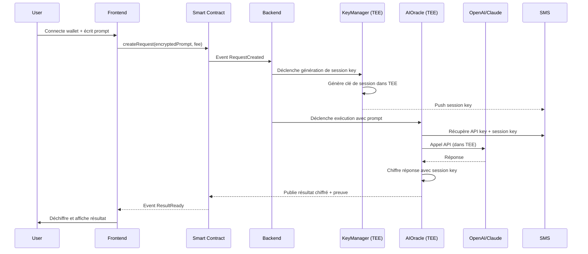

# 🔐 PrivateAI Gateway

## Vision

**Le premier oracle IA décentralisé et privé pour Web3**

PrivateAI Gateway permet aux smart contracts et dApps d'accéder à des modèles d'IA (GPT, Claude, etc.) de manière **totalement privée** - ni les prompts, ni les réponses, ni les clés API ne sont jamais exposés.

---

## 🎯 Le Problème

### Aujourd'hui, utiliser l'IA dans Web3 est un cauchemar de privacy :

| Problème                    | Impact                                                                                |
| --------------------------- | ------------------------------------------------------------------------------------- |
| **Clés API exposées**       | Les développeurs doivent stocker leurs clés API quelque part - elles sont vulnérables |
| **Prompts visibles**        | Les données envoyées à l'IA sont visibles dans les logs/transactions                  |
| **Réponses interceptables** | Les résultats de l'IA peuvent être interceptés ou modifiés                            |
| **Pas d'audit trail**       | Impossible de prouver qu'une réponse vient vraiment de l'IA                           |
| **Centralisation**          | Dépendance à un serveur backend centralisé                                            |

### Cas concrets où c'est critique :

1. **DeFi** : Analyse de risque par IA sans révéler les positions
2. **DAO** : Résumés de propositions par IA sans biais
3. **NFT** : Génération de métadonnées uniques et vérifiables
4. **Gaming** : Génération de contenu procédural vérifiable
5. **Legal/Compliance** : Analyse de documents confidentiels

---

## 💡 Notre Solution

### PrivateAI Gateway utilise iExec TEE + notre mécanisme de secrets automatiques

```
┌─────────────────┐     ┌──────────────────┐     ┌─────────────────┐
│   Frontend      │     │   Smart Contract │     │   Backend API   │
│   (React/Next)  │────▶│   (Arbitrum)     │────▶│   (Express)     │
└─────────────────┘     └──────────────────┘     └─────────────────┘
                                │
                                ▼
                    ┌──────────────────────┐
                    │   iExec TEE Apps     │
                    │                      │
                    │  ┌────────────────┐  │
                    │  │ KeyManager     │  │  ← Génère & stocke les API keys
                    │  │ (TargetApp)    │  │    dans le SMS automatiquement
                    │  └───────┬────────┘  │
                    │          │           │
                    │          ▼           │
                    │  ┌────────────────┐  │
                    │  │ AIOracle       │  │  ← Utilise la clé API pour
                    │  │ (ConsumeApp)   │  │    appeler l'IA et retourner
                    │  └────────────────┘  │    le résultat chiffré
                    │                      │
                    └──────────────────────┘
                                │
                                ▼
                    ┌──────────────────────┐
                    │   Résultat Chiffré   │
                    │   + Preuve TEE       │
                    └──────────────────────┘
```

### 🔒 Ce qui reste TOUJOURS privé :

- ✅ Clé API OpenAI/Anthropic/etc.
- ✅ Prompt de l'utilisateur
- ✅ Réponse de l'IA
- ✅ Toute donnée sensible dans la requête

### 📜 Ce qui est PUBLIC (pour la transparence) :

- Hash du prompt (pour vérification)
- Preuve d'exécution TEE
- Timestamp et métadonnées

---

## 🏗️ Architecture Technique

### Composants

```
privateai-gateway/
├── contracts/              # Smart contracts Solidity
│   ├── PrivateAIGateway.sol
│   ├── RequestManager.sol
│   └── ResultVerifier.sol
│
├── iapps/                  # iExec TEE Applications
│   ├── KeyManager/         # Gère les clés API (comme TargetApp)
│   └── AIOracle/           # Exécute les requêtes IA (comme ConsumeApp)
│
├── backend/                # API Backend (Express/Node)
│   ├── src/
│   │   ├── api/
│   │   ├── services/
│   │   └── utils/
│   └── package.json
│
├── frontend/               # Interface Web (Next.js)
│   ├── src/
│   │   ├── app/
│   │   ├── components/
│   │   └── lib/
│   └── package.json
│
└── docs/                   # Documentation
```

### Flow Utilisateur



---

## 💰 Modèle Économique

### Revenue Streams

| Source              | Description                   | Prix            |
| ------------------- | ----------------------------- | --------------- |
| **Pay-per-query**   | Frais par requête IA          | $0.01 - $0.10   |
| **Subscription**    | Plan mensuel pour entreprises | $99 - $999/mois |
| **API Key Hosting** | Stockage sécurisé de clés     | $9.99/mois      |
| **Custom Models**   | Intégration de modèles privés | Sur devis       |
| **White Label**     | Solution en marque blanche    | Sur devis       |

### Tokenomics (Optionnel)

- **$PRAI Token** : Gouvernance + réductions sur les frais
- Staking pour devenir opérateur de nœud
- Revenue sharing avec les stakers

---

## 🚀 Roadmap

### Phase 1 : MVP (4 semaines)

- [x] Mécanisme de secrets automatiques (FAIT ✅)
- [ ] KeyManager iApp (génération de clés API)
- [ ] AIOracle iApp (appel OpenAI)
- [ ] Smart contract basique
- [ ] Interface web minimaliste
- [ ] Déploiement sur Arbitrum Sepolia

### Phase 2 : Beta (8 semaines)

- [ ] Support multi-modèles (OpenAI, Anthropic, Mistral)
- [ ] Chiffrement end-to-end des prompts
- [ ] Dashboard utilisateur complet
- [ ] API REST pour développeurs
- [ ] Documentation complète

### Phase 3 : Launch (12 semaines)

- [ ] Audit de sécurité
- [ ] Déploiement mainnet
- [ ] SDK JavaScript/Python
- [ ] Intégrations DeFi partenaires
- [ ] Marketing et launch

### Phase 4 : Scale

- [ ] Token launch (optionnel)
- [ ] Marketplace de modèles
- [ ] Mobile app
- [ ] Enterprise features

---

## 🎯 Avantages Concurrentiels

| Nous                                              | Concurrents (Chainlink, etc.) |
| ------------------------------------------------- | ----------------------------- |
| **Privacy totale** : Prompts et réponses chiffrés | Données visibles on-chain     |
| **Clés API sécurisées** : Stockées dans SMS       | Clés exposées ou centralisées |
| **Preuve TEE** : Exécution vérifiable             | Confiance en l'opérateur      |
| **Décentralisé** : Pas de serveur central         | Point de failure unique       |
| **Multi-modèles** : OpenAI, Claude, Mistral...    | Limité à un provider          |

---

## 🛠️ Stack Technique

### Backend

- **Node.js** + **Express** : API REST
- **iExec SDK** : Orchestration des iApps
- **ethers.js** : Interaction blockchain
- **PostgreSQL** : Base de données
- **Redis** : Cache et queue

### Frontend

- **Next.js 14** : React framework
- **TailwindCSS** : Styling
- **RainbowKit** : Wallet connection
- **wagmi** : React hooks pour Web3
- **Framer Motion** : Animations

### Smart Contracts

- **Solidity** : Langage
- **Hardhat** : Framework
- **OpenZeppelin** : Librairies sécurisées

### iExec

- **iExec SDK** : v8.x
- **TEE** : Intel SGX / Scone
- **SMS** : Secret Management Service

---

## 🎨 Maquettes UI

### Page d'accueil

```
┌────────────────────────────────────────────────────────────────┐
│  🔐 PrivateAI Gateway                    [Connect Wallet]      │
├────────────────────────────────────────────────────────────────┤
│                                                                │
│     Access AI models with complete privacy                     │
│     Your prompts. Your data. Your secrets.                     │
│                                                                │
│     ┌──────────────────────────────────────────────────────┐   │
│     │ Enter your prompt...                                 │   │
│     │                                                      │   │
│     │                                                      │   │
│     └──────────────────────────────────────────────────────┘   │
│                                                                │
│     [ GPT-4 ▼ ]  [ 🔒 Private Mode ]  [ Send Request → ]       │
│                                                                │
├────────────────────────────────────────────────────────────────┤
│  Recent Requests                                               │
│  ├─ #1234 ✅ Completed - GPT-4 - 2 min ago                     │
│  ├─ #1233 ⏳ Processing - Claude - 5 min ago                   │
│  └─ #1232 ✅ Completed - GPT-4 - 1 hour ago                    │
└────────────────────────────────────────────────────────────────┘
```

### Dashboard

```
┌────────────────────────────────────────────────────────────────┐
│  Dashboard                                      0x0400...f2 🟢  │
├────────────────┬───────────────────────────────────────────────┤
│                │                                               │
│  📊 Overview   │   Total Requests: 1,234                       │
│  🔑 API Keys   │   Total Spent: 12.5 RLC                       │
│  📜 History    │   Privacy Score: 100%                         │
│  ⚙️ Settings   │                                               │
│                │   ┌─────────────────────────────────────────┐ │
│                │   │ Usage This Month                        │ │
│                │   │ ████████████░░░░░░░░ 60%                │ │
│                │   └─────────────────────────────────────────┘ │
│                │                                               │
│                │   Active API Keys: 3                          │
│                │   ├─ OpenAI GPT-4 ✅                          │
│                │   ├─ Anthropic Claude ✅                      │
│                │   └─ Mistral ⏳ Pending                       │
│                │                                               │
└────────────────┴───────────────────────────────────────────────┘
```

---

## 🚀 Getting Started (Dev)

```bash
# Clone le projet
git clone https://github.com/yourorg/privateai-gateway
cd privateai-gateway

# Installer les dépendances
npm install

# Configurer l'environnement
cp .env.example .env

# Lancer en développement
npm run dev
```

---

## 📞 Contact

- **Website** : privateai.io
- **Twitter** : @privateai_io
- **Discord** : discord.gg/privateai
- **Email** : hello@privateai.io

---

## 📄 License

MIT License - Libre d'utilisation commerciale
